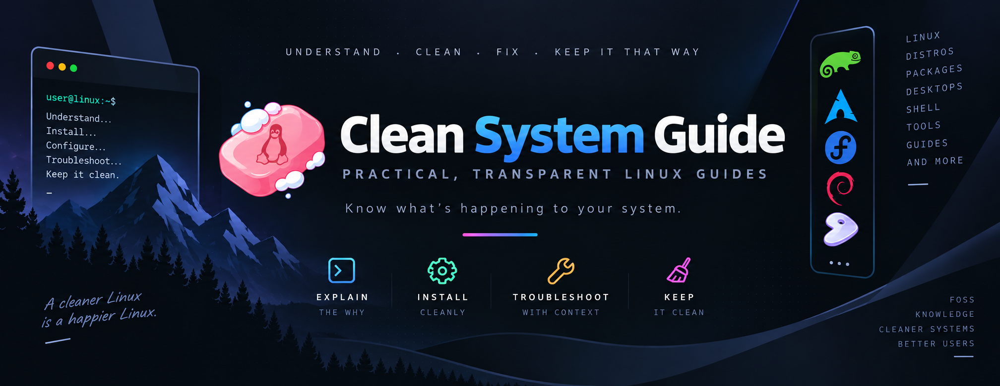

<div align="center">



### Practical, transparent Linux guides for people who want to know what's happening to their system.

[](./LICENSE)
[](#-guide-index)
[](https://github.com/itachi-re/clean-system-guide/commits/main)
[](https://github.com/itachi-re/clean-system-guide/stargazers)
[](https://github.com/itachi-re/clean-system-guide/issues)

[](https://www.kernel.org)
[](#-environment-this-repo-is-built-on)
[](https://www.opensuse.org)
[](https://archlinux.org)
[](https://fedoraproject.org)
[](https://www.debian.org)
[](https://kde.org/plasma-desktop/)
[](https://wayland.freedesktop.org)
[](https://www.zsh.org)

**[Guide Index](#-guide-index)** · **[Find by Goal](#-find-a-guide-by-goal)** · **[Philosophy](#-philosophy)** · **[Quick Start](#-quick-start)** · **[Contributing](#-contributing)** · **[FAQ](#-faq)** · **[Roadmap](#-roadmap)**

</div>

---

## 📌 Why This Repository Exists

Most Linux guides ask for blind trust:

> *"Add this third-party repo."*
> *"Run this installer script."*
> *"Just install these 12 dependencies."*
> *"It works on my machine."*

If you've ever paused before `sudo bash install.sh` and thought **"wait, what does this actually do?"** — this repository is for you.

`clean-system-guide` is a collection of battle-tested Linux guides that explain not just the commands, but the reasoning behind them: what gets installed, what it touches on your system, and how to undo it if it goes wrong. Every guide here came out of a real problem — a broken install, a bloated dependency tree, an unwanted background daemon, or a workflow that had to be cleaner.

Guides are written and tested across **openSUSE Tumbleweed, Arch, Fedora, and Debian/Ubuntu**, with package-manager-specific commands (`zypper` / `pacman` / `dnf` / `apt`) called out wherever they diverge.

---

## 🎯 Philosophy

> Understand what you install. Keep what you need. Automate what you repeat. Trust nothing blindly.

Every guide in this repository is built around five non-negotiable constraints:

| Principle | What it means in practice |
|---|---|
| ✅ **Transparency** | You know exactly what's being installed, from where, and why |
| ✅ **Portability** | Solutions are self-contained where possible — easy to move, easy to remove |
| ✅ **Clean rollback** | If something breaks, there's a documented way to undo it |
| ✅ **Minimal trust** | Fewer parties in the chain between you and your software |
| ✅ **Readable automation** | Scripts you can audit line-by-line, not black boxes |

These aren't aspirations — they're requirements. A guide that violates them doesn't get merged.

---

## ✨ What Makes This Different

- **No blind `curl | bash`.** Every script is explained before it's run, not after.
- **Written from real breakage**, not theoretical best practices — each guide exists because something needed fixing.
- **Genuinely multi-distro**, not just "should work elsewhere" — tested on openSUSE Tumbleweed, Arch, Fedora, and Debian/Ubuntu, with per-distro commands called out explicitly.
- **Terminal-first.** GUI tools are mentioned when relevant, but every guide assumes you're comfortable in a shell.
- **No dead guides.** Outdated content is marked `deprecated` with an explanation, never silently deleted.

---

## 🚀 Quick Start

```bash
# HTTPS
git clone https://github.com/itachi-re/clean-system-guide.git

# or SSH
git clone git@github.com:itachi-re/clean-system-guide.git

cd clean-system-guide
```

Only want the latest snapshot, without history? Use a shallow clone:

```bash
git clone --depth 1 https://github.com/itachi-re/clean-system-guide.git
```

Guides are organized into topic folders. Browse the [Guide Index](#-guide-index) below, or jump straight to a guide:

```bash
# Read a guide before touching your download setup
less files/aria2c-guide.md

# Search every guide for a command or package manager
grep -rn --include="*.md" "zypper" .
```

No build step, no dependencies, no tooling required — it's Markdown, meant to be read.

> [!NOTE]
> Read a guide **before** you run anything from it. The whole point of this repository is that you understand each step first. Every guide explains what a command touches and how to undo it.

---

## 🗂 Guide Index

**19 guides** across 8 topics, plus helper scripts.

### 🖋 editors/

| Guide | Solves |
|---|---|
| [VS Code Without Microsoft's Repo](./editors/vscode-installation.md) | Portable VS Code / VSCodium with zero package-manager involvement |
| [Cursor Installation](./editors/cursor-installation.md) | Clean, cross-distro Cursor install (dnf/zypper/apt/AppImage fallback) |
| [Antigravity Installation](./editors/antigravity-installation.md) | A clean install with no system-wide side effects |

### 📦 files/

| Guide | Solves |
|---|---|
| [Aria2c Guide](./files/aria2c-guide.md) | Multi-connection, resumable downloads from the terminal — no GUI, no daemon, no wasted bandwidth |
| [Linux Archiving Guide](./files/linux-archiving-guide.md) | `tar`, compression formats, and knowing which to use when |
| [Linux Archive Extraction Guide](./files/linux-archive-extraction-guide.md) | Extracting any archive format cleanly, without guessing flags |
| [File Deletion Guide](./files/file-deletion-guide.md) | Proper file removal — `rm` isn't always the right answer |
| [Terminal Batch Renaming Guide](./files/terminal-batch-renaming-guide.md) | Renaming large batches of files safely from the shell |

### 🎬 media/

| Guide | Solves |
|---|---|
| [FFmpeg Guide](./media/ffmpeg-guide.md) | Encoding, converting, and processing media entirely from the terminal |
| [Photo Management Guide](./media/photo-management-guide.md) | Managing photos without cloud dependency or bloated software |

### 🌐 networking/

| Guide | Solves |
|---|---|
| [Ethernet Cable Guide](./networking/ethernet-cable-guide.md) | Diagnosing and fixing wired connection issues |
| [Linux VPN Guide](./networking/linux-vpn-guide.md) | Setting up a VPN without a vendor's black-box client |

### 🌍 browsers/

| Guide | Solves |
|---|---|
| [Brave Linux Troubleshooting Guide](./browsers/brave-linux-troubleshooting-guide.md) | Common Brave-on-Linux issues and clean fixes |

### 🛠 system/

| Guide | Solves |
|---|---|
| [Clear System Cache](./system/clear-system-cache.md) | Safely reclaim memory and disk space without breaking anything |
| [Offline Fedora Repository Guide](./system/offline-fedora-repository-guide.md) | Setting up and using local/offline repos on Fedora |

### 🐚 shell/

| Guide | Solves |
|---|---|
| [Shell Aliases](./shell/shell-aliases.md) | Aliases that actually save time — the ones that survived a hard pruning pass |
| [Tmux Guide](./shell/tmux-guide.md) | Terminal multiplexing without a bloated config |
| [GNU Stow Dotfiles](./shell/gnu-stow-dotfiles.md) | Version-controlled configs with symlinks managed automatically — no manual linking, no drift |

### 🎮 gaming/

| Guide | Solves |
|---|---|
| [Games from ISO with Lutris](./gaming/install-games-iso-lutris-linux.md) | Running ISO-based games on Linux without polluting the system — extract, mount, install through a managed Wine prefix, and leave no stray mounts or prefixes behind |

### ⚙️ scripts/

Helper scripts referenced by the guides above — kept separate since they're meant to be read and run, not browsed as prose.

| Script | Used by |
|---|---|
| [update-vscode.sh](./scripts/update-vscode.sh) | [VS Code Without Microsoft's Repo](./editors/vscode-installation.md) |
| [update-antigravity.sh](./scripts/update-antigravity.sh) | [Antigravity Installation](./editors/antigravity-installation.md) |

### ⭐ Start here if you're new

If you only read three guides in this repository, make it these:

1. **[Aria2c Guide](./files/aria2c-guide.md)** — the single highest-leverage guide here; multi-connection downloads with full control, no GUI client required.
2. **[GNU Stow Dotfiles](./shell/gnu-stow-dotfiles.md)** — the cleanest dotfile-management approach that doesn't require learning a new tool's DSL.
3. **[VS Code Without Microsoft's Repo](./editors/vscode-installation.md)** — a good example of the repo's core philosophy: same software, fewer trusted parties.

---

## 🧭 Find a Guide by Goal

Not sure which folder to look in? Start from what you're trying to do.

| I want to… | Read |
|---|---|
| Download large files reliably, with resume | [Aria2c Guide](./files/aria2c-guide.md) |
| Install an editor without adding a vendor's repo | [VS Code](./editors/vscode-installation.md) · [Cursor](./editors/cursor-installation.md) · [Antigravity](./editors/antigravity-installation.md) |
| Pack or unpack archives without guessing flags | [Archiving](./files/linux-archiving-guide.md) · [Extraction](./files/linux-archive-extraction-guide.md) |
| Delete files properly, or rename hundreds at once | [File Deletion](./files/file-deletion-guide.md) · [Batch Renaming](./files/terminal-batch-renaming-guide.md) |
| Convert or process video and audio | [FFmpeg Guide](./media/ffmpeg-guide.md) |
| Manage photos without the cloud | [Photo Management Guide](./media/photo-management-guide.md) |
| Fix a flaky wired connection | [Ethernet Cable Guide](./networking/ethernet-cable-guide.md) |
| Set up a VPN without a vendor client | [Linux VPN Guide](./networking/linux-vpn-guide.md) |
| Fix Brave crashing, freezing, or rendering badly | [Brave Troubleshooting](./browsers/brave-linux-troubleshooting-guide.md) |
| Free up disk space or memory safely | [Clear System Cache](./system/clear-system-cache.md) |
| Use an offline or local repo on Fedora | [Offline Fedora Repository](./system/offline-fedora-repository-guide.md) |
| Keep my dotfiles in git without manual linking | [GNU Stow Dotfiles](./shell/gnu-stow-dotfiles.md) |
| Tame my terminal workflow | [Tmux Guide](./shell/tmux-guide.md) · [Shell Aliases](./shell/shell-aliases.md) |
| Install an ISO-based Windows game cleanly | [Games from ISO with Lutris](./gaming/install-games-iso-lutris-linux.md) |

---

## 📚 Repository Structure

Guides live in topic-based subfolders so the repo stays navigable as it grows:

```
editors/      networking/    browsers/      media/
files/        system/        shell/         gaming/
scripts/      ← helper scripts referenced by guides above
assets/img/   ← banner and images used by the README
```

Every guide follows the same four-part structure, so you always know where to look:

```
1. The Problem          → what broke, what was missing, or what needed to improve
2. The Clean Solution    → how to fix it without polluting the system
3. The Commands          → exact steps, each one explained
4. Alternatives          → other approaches, and why this one was chosen instead
```

This consistency means you can skim any guide in this repo the same way, whether it's about `ffmpeg` or dotfiles.

---

## 💡 Design Principles

<details>
<summary><b>Why "clean" specifically?</b></summary>
<br>

"Clean" here means auditable and reversible — not minimal for its own sake. A guide can install ten packages and still be clean, as long as you know what each one does and how to remove it. Conversely, a one-line installer script that silently touches your shell config, adds a repo, and drops a systemd service is *not* clean, even though it looks simple.

</details>

<details>
<summary><b>Why terminal-first?</b></summary>
<br>

GUI installers hide state changes behind a progress bar. The terminal makes every step explicit and, more importantly, scriptable and reviewable — you can read a shell command before running it in a way you generally can't with a GUI wizard.

</details>

<details>
<summary><b>Why test across four distros instead of picking one?</b></summary>
<br>

Package managers and path layouts diverge just enough (`zypper` vs `pacman` vs `dnf` vs `apt`, `/usr/lib` vs `/usr/lib64`, systemd unit locations, etc.) that a guide written for one distro often silently breaks on another. Testing across openSUSE Tumbleweed, Arch, Fedora, and Debian/Ubuntu means the guides that claim to be distro-agnostic actually are — and the ones that aren't say so up front.

</details>

---

## 🧩 Environment This Repo Is Built On

| | |
|---|---|
| **Primary distro** | openSUSE Tumbleweed |
| **Also tested on** | Arch, Fedora, Debian/Ubuntu |
| **Desktop** | KDE Plasma (Wayland); Hyprland and Sway also in regular use |
| **Shell** | zsh |
| **Terminal / Editor** | Ghostty · Konsole / Neovim |
| **Filesystem** | Btrfs (ext4 elsewhere) |
| **Packaging** | Custom RPMs on [OBS `home:itachi_re`](https://build.opensuse.org/project/show/home:itachi_re) |
| **Approach** | Minimal installs, portable apps, manual control |
| **App Storage** | `/data/itachi/AppImages/` |

Your setup doesn't need to match this exactly — the guides are written to be adapted, not copy-pasted verbatim.

---

## 🔗 Related Projects

Other repositories by the same author that pair naturally with these guides.

| Project | What it is | Related guide |
|---|---|---|
| [.dotfiles](https://github.com/itachi-re/.dotfiles) | Personal dotfiles managed with GNU Stow | [GNU Stow Dotfiles](./shell/gnu-stow-dotfiles.md) |
| [dotfiles-android](https://github.com/itachi-re/dotfiles-android) | Android + Termux dotfiles, configs, and scripts (MPV, FFmpeg, shell) | [FFmpeg Guide](./media/ffmpeg-guide.md) |
| [brave-browser-obs](https://github.com/itachi-re/brave-browser-obs) | Update tracker for Brave on OBS, repackaging official RPMs with system-integration fixes | [Brave Troubleshooting](./browsers/brave-linux-troubleshooting-guide.md) |
| [obs-auto-trigger](https://github.com/itachi-re/obs-auto-trigger) | Automated upstream version tracking and OBS rebuilds for 100+ packages | — |
| [android-studio-obs](https://github.com/itachi-re/android-studio-obs) | Android Studio automation for openSUSE Tumbleweed on OBS | — |

### 📎 Longer references

Some longer, single-topic write-ups live as [gists](https://gist.github.com/itachi-re) rather than in this repo, including:

- **[Android debloating reference](https://gist.github.com/itachi-re/6a8751814be39b4cf455dd64efe8d21b)** — safety-rated (🟢 / 🟡 / 🔴) removal lists, ADB, UAD-ng, and root-based methods.
- **[Beyond systemd: Choosing the Right Init System](https://gist.github.com/itachi-re/b1d4853635db01978d1f42f76484c8c6)**
- **ProtonVPN Linux GUI (Beta) — install and removal**, per distro (see the gist index).
- **OpenWrt on the Imou HX21** (see the gist index).

---

## ❓ FAQ

<details>
<summary><b>Do these guides work on Arch / Fedora / Debian / Ubuntu?</b></summary>
<br>

Yes — these four are the distros the guides are actually developed and tested on, alongside openSUSE Tumbleweed as the primary environment. Package-manager-specific commands are called out per distro wherever they differ (`zypper` vs `pacman` vs `dnf` vs `apt`). If a guide is genuinely distro-specific (e.g. the offline Fedora repository guide), that's noted at the top.

</details>

<details>
<summary><b>Why not just use Flatpak / Snap for everything?</b></summary>
<br>

Sometimes that's exactly the right answer, and a guide will say so. This repo isn't anti-sandboxing — it's anti-*unexamined* installation. A Flatpak install you understand is perfectly "clean" by this repo's standard.

</details>

<details>
<summary><b>Are these guides beginner-friendly?</b></summary>
<br>

They assume basic terminal comfort — you should know your way around `cd`, `sudo`, and a text editor. Beyond that, every command is explained, so you don't need prior expertise with the specific tool being covered.

</details>

<details>
<summary><b>What happens to outdated guides?</b></summary>
<br>

They're marked `deprecated` with a note explaining what changed and why, rather than deleted outright. History has value, even when the advice no longer applies.

</details>

<details>
<summary><b>Why did the guides move into subfolders?</b></summary>
<br>

The repo grew past 20 flat markdown files at the root, which made browsing harder than it needed to be. Guides are now grouped by topic (editors, files, media, networking, browsers, system, shell, gaming) with `scripts/` kept separate since those are meant to be run, not read top-to-bottom.

If you have an old link to a root-level file such as `install-games-iso-lutris-linux.md`, look for it in its topic folder instead (for example `gaming/`).

</details>

<details>
<summary><b>How do I know a guide is still current?</b></summary>
<br>

Check the last-commit badge at the top for the repository as a whole, or run `git log -- path/to/guide.md` for a single guide. Anything no longer accurate is marked `deprecated` rather than left to rot silently.

</details>

---

## 🤝 Contributing

Contributions are welcome if they fit the repository's philosophy.

**Rules:**

- Must solve a real problem, not a hypothetical one.
- Prioritize system cleanliness and transparency over convenience.
- Explain the *why*, not just the *how*.
- No "just run this script" without a full explanation of what it does.
- Place new guides in the topic folder they best fit (create a new folder only if none fit).

Open a PR if you've solved something cleanly and it fits here. Open an issue if a guide is out of date or a command no longer works as written.

<details>
<summary><b>📋 Pull request checklist</b></summary>
<br>

- [ ] The guide solves a real problem I actually hit
- [ ] Every command is explained, and nothing is piped blindly into a shell
- [ ] It says what gets installed, from where, and what it touches on the system
- [ ] It documents how to undo everything (rollback / removal)
- [ ] Per-distro commands (`zypper` / `pacman` / `dnf` / `apt`) are called out where they differ
- [ ] It follows the four-part structure below
- [ ] It's in the right topic folder, and linked from the [Guide Index](#-guide-index)
- [ ] The guide count in the README badge and footer is updated

</details>

<details>
<summary><b>📝 Guide template</b></summary>
<br>

```markdown
# Guide Title

> One sentence: what this solves and for whom.

**Tested on:** openSUSE Tumbleweed · Arch · Fedora · Debian/Ubuntu

## 1. The Problem
What broke, what was missing, or what needed to improve.

## 2. The Clean Solution
How to fix it without polluting the system, and what it touches.

## 3. The Commands
Exact steps, each one explained. Call out per-distro differences.

## 4. Alternatives
Other approaches, and why this one was chosen instead.

## Rollback
How to undo everything above.
```

</details>

---

## 🛣 Roadmap

Planned additions, in no particular order:

- [ ] Flatpak vs AppImage decision guide
- [ ] Minimal dev environment setup from scratch
- [ ] Dotfile management without any tooling — pure symlinks, manual approach
- [ ] *...and whatever breaks next*

---

## 🌟 Star History

<a href="https://star-history.com/#itachi-re/clean-system-guide&Date">
  <picture>
    <source media="(prefers-color-scheme: dark)" srcset="https://api.star-history.com/svg?repos=itachi-re/clean-system-guide&type=Date&theme=dark" />
    <source media="(prefers-color-scheme: light)" srcset="https://api.star-history.com/svg?repos=itachi-re/clean-system-guide&type=Date" />
    
  </picture>
</a>

---

## ❤️ Support the Project

If a guide here saved you from a broken install or a bloated dependency tree, consider:

- ⭐ **Starring the repo** — it's the easiest way to help others find it.
- 🐛 **Opening an issue** if something's out of date.
- 🔧 **Submitting a PR** if you've solved something cleanly.

---

## 📝 License

MIT — use it, fork it, adapt it. If it helps you run a system you actually understand, that's enough.

---

<div align="center">

**Disclaimer:** These guides reflect one person's setup, threat model, and preferences. Read, understand, and adapt them — don't blindly copy-paste, for the same reason this repo exists in the first place.

*"The best system is one you understand completely and control entirely."*

<!-- Keep in sync with the "Guides" badge at the top and the Guide Index (currently 19). -->
**Status:** Active · **Guides:** 19 · [](https://github.com/itachi-re/clean-system-guide/commits/main)

</div>
