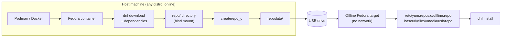
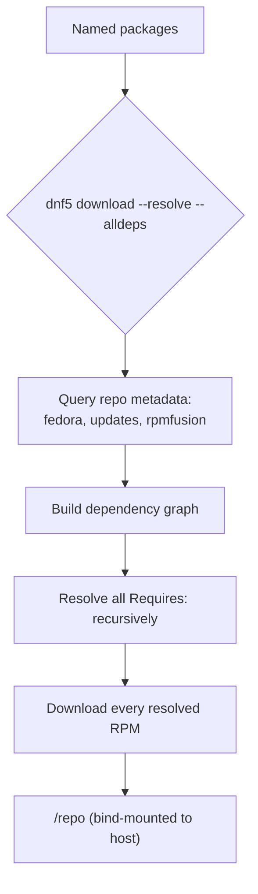
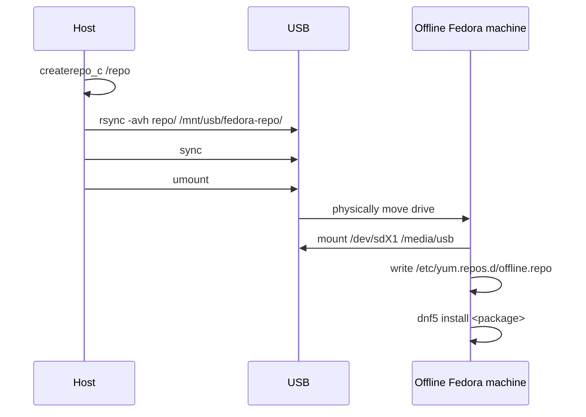

# Building an Offline Fedora Software Repository

A complete handbook for building a portable, USB-deployable Fedora package repository from any Linux distribution using containers — for codecs, third-party software, and fully air-gapped installation.

---

## Table of Contents

1. [Introduction](#introduction)
2. [Understanding the Problem](#understanding-the-problem)
3. [Core Concepts](#core-concepts)
4. [Architecture Overview](#architecture-overview)
5. [Requirements and Prerequisites](#requirements-and-prerequisites)
6. [Supported Host Systems and Fedora Versions](#supported-host-systems-and-fedora-versions)
7. [Step 1 — Installing a Container Engine](#step-1--installing-a-container-engine)
8. [Step 2 — Preparing the Working Directory](#step-2--preparing-the-working-directory)
9. [Step 3 — Pulling a Fedora Container](#step-3--pulling-a-fedora-container)
10. [Step 4 — Enabling RPM Fusion and Extra Repositories](#step-4--enabling-rpm-fusion-and-extra-repositories)
11. [Step 5 — Downloading Packages and Dependencies](#step-5--downloading-packages-and-dependencies)
12. [Step 6 — Building Repository Metadata with createrepo_c](#step-6--building-repository-metadata-with-createrepo_c)
13. [Step 7 — Verifying Repository Integrity](#step-7--verifying-repository-integrity)
14. [Step 8 — Copying the Repository to USB](#step-8--copying-the-repository-to-usb)
15. [Step 9 — Offline Installation on the Target Fedora Machine](#step-9--offline-installation-on-the-target-fedora-machine)
16. [Step 10 — Installing Standalone Third-Party RPMs](#step-10--installing-standalone-third-party-rpms)
17. [Repository Layout Reference](#repository-layout-reference)
18. [Package Categories](#package-categories)
19. [Maintaining and Updating the Repository](#maintaining-and-updating-the-repository)
20. [Multiple Fedora Versions and Architectures](#multiple-fedora-versions-and-architectures)
21. [Cleaning Up Obsolete Packages](#cleaning-up-obsolete-packages)
22. [Verifying a Successful Installation](#verifying-a-successful-installation)
23. [Troubleshooting](#troubleshooting)
24. [Security Considerations](#security-considerations)
25. [Performance Considerations](#performance-considerations)
26. [Best Practices](#best-practices)
27. [Frequently Asked Questions](#frequently-asked-questions)
28. [Appendix — Useful Commands](#appendix--useful-commands)
29. [References](#references)

---

## Introduction

Fedora ships with a deliberately restricted package set. Patent-encumbered codecs, certain firmware blobs, and a range of third-party desktop applications are excluded from the official repositories for legal and policy reasons. On a machine with internet access, this is a minor inconvenience solved by enabling RPM Fusion. On a machine that is offline — a lab workstation, an air-gapped server, a laptop about to go somewhere without connectivity, or a machine behind a restrictive network — it becomes a real obstacle.

This guide describes a repeatable, distribution-agnostic method for solving that problem: build a **local RPM repository** on any machine that does have internet access (regardless of what Linux distribution that machine runs), package it onto a USB drive, and install from it on the offline Fedora system using nothing but `dnf` and a mounted filesystem.

The technique relies on three ideas that are each simple in isolation:

1. **Containers give you a clean Fedora userspace anywhere.** You do not need to own a Fedora machine to download Fedora packages correctly. A container running the target Fedora release, on any host, produces the same package resolution the target system would.
2. **RPM repositories are just directories with metadata.** Nothing about "being a repository" requires a network server. A folder of `.rpm` files plus a `repodata/` directory generated by `createrepo_c` is a fully functional repository, whether it's served over HTTPS or read from `/media/usb`.
3. **DNF does not care where a repository lives.** A `baseurl=file:///...` entry in a `.repo` file is treated identically to `baseurl=https://...`. This is the property that makes offline installation possible at all.

> **NOTE**
> This guide targets `dnf5`, the version shipped by default starting with Fedora 41 and now standard in Fedora 42 and later. Where command syntax differs from legacy `dnf4`, both are shown.

---

## Understanding the Problem

### Why Fedora excludes multimedia codecs

Fedora is stewarded by Red Hat and governed by strict adherence to software patent and licensing law, primarily because it is distributed from the United States, where software patents on multimedia codecs (H.264, H.265/HEVC, AAC, and historically MP3) have been enforceable. Shipping decoders or encoders for these formats in the base distribution would expose the Fedora Project to patent-licensing liability.

This is a **policy decision**, not a technical limitation. The code to support these formats exists and works fine on Fedora; it is simply not distributed by Fedora's own infrastructure. This is why third-party repositories such as **RPM Fusion** — which are hosted outside Fedora's infrastructure and outside the direct legal umbrella of Red Hat — exist specifically to fill this gap.

The consequence for an offline machine is that the packages you need (`gstreamer1-plugins-bad-freeworld`, `ffmpeg`, `libavcodec-freeworld`, and similar) are not just missing from Fedora's mirrors — they were never on Fedora's mirrors to begin with. You must source them from RPM Fusion, which itself requires network access at least once.

### Why this needs a repository, not just individual RPM files

You might expect that copying a handful of `.rpm` files to a USB stick and running `dnf install *.rpm` would be sufficient. This fails in practice for the same reason installing software online works so smoothly: **dependency resolution**. Every RPM package declares a list of other packages, libraries, or file paths it needs (its `Requires:` metadata). `dnf` normally resolves these automatically against repository metadata. Given a bag of loose files with no metadata, `dnf`/`rpm` can only check dependencies against what is *already installed* — it has no way to discover that package B on the USB stick satisfies package A's requirement, unless you tell it via generated repository metadata.

Building a real repository (with a `repodata/` directory) restores full dependency resolution, exactly as if you were pointed at a live mirror.

---

## Core Concepts

### RPM packages

An RPM (`.rpm`) file is a compressed archive combining program files, installation scripts, and structured metadata: name, version, release, architecture, license, dependency declarations, and a changelog. `rpm` is the low-level tool that installs and removes these files and enforces their dependency constraints. `dnf` sits above `rpm` and adds automatic dependency resolution, repository awareness, and transaction handling.

### DNF5

DNF5 is a full rewrite of Fedora's package manager in C++ (the historical `dnf`/`dnf4` was Python). It is faster, uses less memory, and unifies functionality that used to be split across `dnf`, `dnf-plugins-core`, and various helper tools. Its command surface is intentionally close to `dnf4`, but a handful of subcommands changed shape — most notably `dnf5 download` behaves differently and `--downloadonly` semantics shifted slightly, both of which matter for this guide and are called out explicitly in the troubleshooting section.

### Repository metadata and `createrepo_c`

A DNF-compatible repository is a directory containing:

```
myrepo/
├── *.rpm                     # the actual packages
└── repodata/
    ├── repomd.xml             # index of all other metadata files
    ├── primary.xml.gz         # package names, versions, deps, file lists
    ├── filelists.xml.gz       # full file manifests per package
    ├── other.xml.gz           # changelogs
    └── *.sqlite (optional)    # legacy fast-lookup format
```

`createrepo_c` (the C reimplementation of the original Python `createrepo`) scans a directory of `.rpm` files and generates this `repodata/` folder. This is the single command that turns "a folder of files" into "a repository DNF can use."

### Dependency resolution

When you ask DNF to install a package, it does not just fetch that one file. It builds a dependency graph: for each `Requires:` entry the package declares, DNF searches all enabled repositories for a package that `Provides:` a match, adds that to the transaction, and repeats recursively until every requirement is satisfied or DNF reports an unresolvable conflict. This is why "download the package and its dependencies" (Step 5 below) is the crux of the entire guide — get this wrong and the USB repository will look complete but fail to install.

### GPG keys and package signatures

RPM packages can be cryptographically signed. Fedora's own packages are signed with Fedora's release GPG key; RPM Fusion signs its packages with its own key. DNF checks these signatures against keys it has been told to trust (stored under `/etc/pki/rpm-gpg/`). An offline repository built from *already-signed* packages retains those signatures — you are not removing security by going offline, provided you import the correct keys on the target machine (covered in Step 9).

### Local repositories and `.repo` files

A `.repo` file (normally under `/etc/yum.repos.d/`) is a small INI-style config block telling DNF where a repository lives and how to trust it:

```ini
[offline-multimedia]
name=Offline Multimedia Repository
baseurl=file:///media/usb/fedora-repo
enabled=1
gpgcheck=1
gpgkey=file:///media/usb/fedora-repo/RPM-GPG-KEY-rpmfusion-free-fedora
```

The `baseurl` scheme (`file://` vs `https://`) is the only thing that changes between an online mirror and a USB drive. Everything else about how DNF treats the repository is identical.

### Air-gapped systems and reproducibility

An air-gapped system is one that is intentionally never connected to a network, typically for security or compliance reasons (industrial control systems, classified environments, compliance-locked lab equipment). The workflow in this guide is the standard pattern for **all** air-gapped software delivery, not just Fedora codecs: build the update payload on a connected "staging" machine, transfer it via removable media, verify it, apply it offline. Because the repository is just files plus deterministic metadata, the same USB image can be reused across many identical target machines, giving you reproducibility — every machine gets byte-identical packages.

### Why containers, and why containers instead of a real Fedora install

You do not need a Fedora machine to correctly download Fedora packages, and you do not want to *pretend* your host distribution's package manager understands Fedora's dependency graph — it doesn't. A **container** running the exact Fedora release you're targeting gives you:

- The correct `dnf`/`rpm` version and behavior for that release.
- The correct default repository definitions (Fedora, Updates, RPM Fusion once added).
- Complete isolation from your host's own package database, so nothing you do here can affect your host system.
- Disposability — delete the container when done; nothing persists except what you explicitly bind-mount out.

### Podman vs Docker

| Aspect | Podman | Docker |
|---|---|---|
| Daemon | Daemonless (fork/exec model) | Requires a background daemon (`dockerd`) |
| Root requirement | Rootless by default | Traditionally root-requiring daemon, rootless mode available but less mature |
| Fedora default | Included and preferred in Fedora, RHEL, openSUSE | Not shipped by default on Fedora/RHEL family |
| Command compatibility | Near drop-in `docker` CLI alias | — |
| Systemd integration | Native (`podman generate systemd`, Quadlet) | Limited |

**Recommendation:** use **Podman** whenever your host distribution offers it natively — this includes Fedora, RHEL, CentOS Stream, and openSUSE. It requires no daemon, no root, and its CLI is command-for-command compatible with Docker (`alias docker=podman` works for nearly everything in this guide). Use Docker only if your host distribution doesn't package Podman well (some older Debian/Ubuntu LTS releases) or if you have an existing Docker-based workflow you don't want to disrupt. Every command in this guide is written for Podman; substituting `docker` in its place works unmodified.

### Bind mounts

A bind mount exposes a directory from the host filesystem inside the container at a chosen path, with changes visible on both sides in real time. This is how packages downloaded *inside* the ephemeral container end up *outside* it, on your host, where you can burn them to USB after the container is deleted:

```bash
podman run -it --rm -v "$(pwd)/repo:/repo:Z" fedora:42 bash
```

The `:Z` suffix (SELinux systems only — Fedora, RHEL, CentOS hosts) relabels the directory so the container is permitted to write to it under SELinux's confinement policy. Omitting it on an SELinux-enforcing host is the single most common cause of "permission denied" errors in this entire workflow.

### Container lifecycle

`podman run --rm` starts a container, gives you a shell, and — on exit — deletes the container's writable layer entirely. Because all package output goes through the bind mount, nothing of value is lost when the container disappears. This "run, work, discard" pattern means you never accumulate stale container state and never need to manually clean up disk usage from old builds — the `--rm` flag is sufficient.

---

## Architecture Overview



The pattern has exactly one network-dependent phase — everything inside the "Host machine" box — and everything on the "Offline Fedora target" side operates purely on local files.

---

## Requirements and Prerequisites

| Requirement | Why it's needed |
|---|---|
| A host machine with internet access | To pull the container image and download packages |
| Podman or Docker on the host | To run an isolated Fedora userspace |
| ~5–15 GB free disk space on the host | Package cache plus repository output (varies heavily by package selection) |
| A USB drive, 8 GB or larger | Transfer medium; size depends on package selection |
| The target Fedora machine's release version known in advance | The container image tag and RPM Fusion release package must match exactly |
| Basic command-line familiarity | This guide assumes no prior *repository-building* knowledge, but does assume you can run a terminal |

> **IMPORTANT**
> The Fedora **release version must match** between the container you build packages in and the target machine you install on (e.g., both Fedora 42). RPM dependency graphs are release-specific; packages built against Fedora 42's library versions are not guaranteed installable on Fedora 41 or 43 without conflicts.

---

## Supported Host Systems and Fedora Versions

This workflow has been validated conceptually against any host capable of running OCI containers, including:

- Fedora, RHEL, CentOS Stream
- openSUSE Tumbleweed / Leap
- Arch Linux, Manjaro
- Debian, Ubuntu and derivatives
- macOS and Windows, via Podman Desktop or Docker Desktop (with a Linux VM underneath)

The only host-side variable is *how you install the container engine* (Step 1). Once Podman or Docker is running, every subsequent command in this guide is host-distribution-agnostic — you are working entirely inside a Fedora container from that point forward.

For the target side, this guide covers current and recent Fedora releases (Fedora 40 through 43 at the time of writing) using DNF5. The same technique works on considerably older Fedora releases using DNF4 syntax noted inline.

---

## Step 1 — Installing a Container Engine

Pick the block matching your **host** distribution.

**Fedora / RHEL / CentOS Stream:**
```bash
sudo dnf install -y podman
```

**openSUSE:**
```bash
sudo zypper install -y podman
```

**Arch Linux:**
```bash
sudo pacman -S podman
```

**Debian / Ubuntu:**
```bash
sudo apt update && sudo apt install -y podman
```

**What this does:** installs the Podman binary and its supporting libraries (`crun`/`runc` as the low-level OCI runtime, `slirp4netns` or `pasta` for rootless networking).

**Verify success:**
```bash
podman --version
podman info --format '{{.Host.Security.Rootless}}'
```
Expect a version string and `true` for rootless status on a typical desktop install.

**Undo:** `sudo dnf remove podman` (or the equivalent for your package manager). Container images pulled separately live under `~/.local/share/containers` and can be removed with `podman system reset`.

---

## Step 2 — Preparing the Working Directory

```bash
mkdir -p ~/fedora-offline-repo/repo
cd ~/fedora-offline-repo
```

**Why:** this is the directory that will be bind-mounted into the container. Keeping it outside your home directory's more sensitive locations, and outside the container entirely, is what lets you delete and recreate containers freely without losing downloaded packages.

---

## Step 3 — Pulling a Fedora Container

```bash
podman pull registry.fedoraproject.org/fedora:42
```

**What this does:** downloads the official Fedora container base image (a minimal userspace, not a full desktop install) from Fedora's own container registry, layer by layer, and caches it locally.

**Expected output:** a series of "Copying blob" progress lines ending in a full image digest (`sha256:...`) and the confirmation line `Writing manifest to image destination`.

**Why the official registry and not Docker Hub's `fedora` image:** both generally track the same content, but `registry.fedoraproject.org` is the canonical, Fedora-Project-maintained source and is guaranteed to be updated promptly on each release.

**Verify:**
```bash
podman images | grep fedora
```

**Undo:** `podman rmi registry.fedoraproject.org/fedora:42`

---

## Step 4 — Enabling RPM Fusion and Extra Repositories

Start the working container with the repo directory bind-mounted:

```bash
podman run -it --rm -v "$(pwd)/repo:/repo:Z" registry.fedoraproject.org/fedora:42 bash
```

Inside the container:

```bash
dnf5 install -y \
  https://download1.rpmfusion.org/free/fedora/rpmfusion-free-release-42.noarch.rpm \
  https://download1.rpmfusion.org/nonfree/fedora/rpmfusion-nonfree-release-42.noarch.rpm
```

**What this does:** installs two tiny "release" packages whose only job is to drop `.repo` files into `/etc/yum.repos.d/` and import RPM Fusion's GPG keys. "Free" and "Non-free" refer to RPM Fusion's own licensing classification (patent status, redistribution terms), not to price — both are free of charge.

> **WARNING**
> The `42` in the URL must match your container's Fedora version exactly. Using the wrong version number will install release packages that point at metadata for the wrong Fedora release, causing dependency resolution failures later.

**Verify:**
```bash
dnf5 repolist
```
Expect to see `fedora`, `updates`, `rpmfusion-free`, `rpmfusion-nonfree`, and their `-updates` counterparts listed as enabled.

**Undo:** `dnf5 remove rpmfusion-free-release rpmfusion-nonfree-release` (only matters if you're reusing a long-lived container rather than a disposable one).

---

## Step 5 — Downloading Packages and Dependencies

This is the step that actually builds your package set, and getting it right is what makes offline installation succeed later.

```bash
dnf5 download --resolve --alldeps --destdir=/repo \
  gstreamer1-plugins-bad-freeworld \
  gstreamer1-plugins-ugly-freeworld \
  gstreamer1-libav \
  ffmpeg \
  libavcodec-freeworld
```

**Flag-by-flag explanation:**

| Flag | Purpose |
|---|---|
| `download` | DNF5 subcommand that fetches packages without installing them |
| `--resolve` | Also resolve and include dependency packages, not just the named ones |
| `--alldeps` | Include dependencies even if they're already satisfied by something else in the set, ensuring the offline repo is self-contained rather than assuming the target already has them |
| `--destdir=/repo` | Write `.rpm` files into the bind-mounted host directory instead of the container's ephemeral filesystem |

> **NOTE — DNF5 vs DNF4 syntax difference**
> On older systems still using `dnf4`, the equivalent command is:
> ```bash
> dnf download --resolve --alldeps --destdir=/repo <packages>
> ```
> syntax is nearly identical, but DNF4's `download` command is provided by the separate `dnf-plugins-core` package (`sudo dnf install dnf-plugins-core`), whereas DNF5 has it built in. Forgetting this plugin is a common source of "unknown command: download" errors on DNF4 systems.

**Expected output:** a list of resolved package names with sizes, followed by download progress bars, ending with all files present in `/repo` on the host.

**Verify:**
```bash
ls repo/*.rpm | wc -l
```
You should see considerably more files than packages you named — this is dependency resolution working correctly.

**Common error — nothing downloads / "no match":** almost always means RPM Fusion wasn't enabled correctly (Step 4) or the package name is wrong for that release. Check with `dnf5 search <partial-name>` first.

**Undo:** simply delete files from `repo/` — nothing here is installed on the container or host system; it is purely file downloads.

Repeat this step for every category of software you want available offline — see [Package Categories](#package-categories) below for suggested lists.

### Package download flow



---

## Step 6 — Building Repository Metadata with `createrepo_c`

Still inside the container:

```bash
dnf5 install -y createrepo_c
createrepo_c /repo
```

**What this does:** scans every `.rpm` file in `/repo`, extracts its header metadata (name, version, dependencies, file list, changelog), and writes the compressed XML index files described in [Core Concepts](#core-concepts) into `/repo/repodata/`.

**Expected output:** progress lines like `Directory walk started`, `Pool started`, `Sqlite DBs saved`, ending in `Repository saved`.

**Verify:**
```bash
ls repo/repodata/
```
You should see `repomd.xml` plus several `*.xml.gz` files (and `.sqlite.bz2` files unless `--no-database` was passed).

**Common error:** running `createrepo_c` against a directory with zero `.rpm` files succeeds silently but produces a useless empty repository — always check `ls repo/*.rpm | wc -l` before this step.

**Undo:** `rm -rf repo/repodata` — safe, it only deletes generated metadata, never the packages themselves.

You can now exit the container; its job is done and its ephemeral filesystem will be discarded:

```bash
exit
```

---

## Step 7 — Verifying Repository Integrity

Back on the host, confirm the repository is structurally valid before trusting it for offline use.

```bash
podman run -it --rm -v "$(pwd)/repo:/repo:Z" registry.fedoraproject.org/fedora:42 bash -c '
  cat > /etc/yum.repos.d/local-check.repo << EOF
[local-check]
name=Local Check
baseurl=file:///repo
enabled=1
gpgcheck=0
EOF
  dnf5 repoquery --repo=local-check | wc -l
  dnf5 repository-packages local-check check-update --refresh 2>&1 | tail -20
'
```

**Why `gpgcheck=0` here specifically:** this is a *structural* integrity check only — confirming the metadata parses and packages are listable. Signature checking is handled separately once installed on the real target (Step 9), where it matters for security, not for a throwaway verification container.

**What "success" looks like:** a non-zero package count from `repoquery`, and no XML/metadata parse errors.

**Optional deeper check — RPM-level integrity:**
```bash
rpm -K repo/*.rpm
```
Confirms each package's internal checksum is intact (catches corrupted downloads) and reports its signature status.

---

## Step 8 — Copying the Repository to USB

Identify the USB device, then copy:

```bash
lsblk
```

Locate the correct device (e.g., `/dev/sda1`) — **do this carefully; picking the wrong device risks data loss on an unrelated disk.**

```bash
sudo mkdir -p /mnt/usb
sudo mount /dev/sda1 /mnt/usb
rsync -avh --progress repo/ /mnt/usb/fedora-repo/
sync
sudo umount /mnt/usb
```

**Command-by-command:**

- `lsblk` — lists block devices and partitions in a tree, letting you visually confirm you have the right USB drive by its size and mount points.
- `mount` — attaches the USB filesystem into the directory tree so it behaves like any other folder.
- `rsync -avh --progress` — copies recursively (`-a`, archive mode preserving permissions/timestamps), human-readable sizes (`-h`), verbosely (`-v`), with a progress meter. `rsync` is preferred over plain `cp -r` because it is resumable — if copying is interrupted (USB pulled early, laptop sleeps), rerunning the same command only copies what's missing or changed, rather than starting over.
- `sync` — forces the kernel to flush any buffered writes to the physical device before you unmount; skipping this is the most common cause of a corrupted copy that looks complete in `ls` but has empty or truncated files.
- `umount` — cleanly detaches the filesystem; a USB drive **must** be unmounted (not just physically removed) or its filesystem journal can be left in an inconsistent state.

**Verify:**
```bash
lsblk /dev/sda
diff -rq repo/ /mnt/usb/fedora-repo/    # run before unmounting
```
An empty `diff` output confirms an exact copy.

**Undo/redo:** simply `rsync` again after making changes — it will only transfer deltas.

### USB deployment process



---

## Step 9 — Offline Installation on the Target Fedora Machine

On the target machine (no network required from this point):

```bash
sudo mkdir -p /media/usb
sudo mount /dev/sdX1 /media/usb   # replace sdX1 with your actual device
```

Import the GPG keys that signed the packages (copied over as part of the repo, or from `/etc/pki/rpm-gpg/` if you copied that directory too):

```bash
sudo rpm --import /media/usb/fedora-repo/RPM-GPG-KEY-rpmfusion-free-fedora
sudo rpm --import /media/usb/fedora-repo/RPM-GPG-KEY-rpmfusion-nonfree-fedora
```

Create the repository definition:

```bash
sudo tee /etc/yum.repos.d/offline-usb.repo << 'EOF'
[offline-usb]
name=Offline USB Repository
baseurl=file:///media/usb/fedora-repo
enabled=1
gpgcheck=1
EOF
```

Install:

```bash
sudo dnf5 install --disablerepo='*' --enablerepo='offline-usb' \
  gstreamer1-plugins-bad-freeworld gstreamer1-plugins-ugly-freeworld ffmpeg
```

**Why `--disablerepo='*' --enablerepo='offline-usb'`:** on a machine that normally has network access but happens to be offline *right now* (e.g., traveling), DNF will otherwise try to contact the regular Fedora mirrors, time out slowly, and clutter the transaction resolution with unreachable repositories. Explicitly restricting to the offline repo makes the transaction fast and deterministic. On a genuinely air-gapped machine with no other repos configured, this is optional but still good practice.

**Expected output:** a standard DNF transaction summary (package list, download size — read from local disk near-instantly — and a `Complete!` message), identical in form to an online install.

**Verify:**
```bash
rpm -q ffmpeg
dnf5 repoquery --installed --repo=offline-usb
```

**Undo:**
```bash
sudo dnf5 remove ffmpeg gstreamer1-plugins-bad-freeworld gstreamer1-plugins-ugly-freeworld
```

---

## Step 10 — Installing Standalone Third-Party RPMs

Some software (browsers, chat clients, IDEs) is distributed as a single `.rpm` with no repository at all — for example a downloaded `.rpm` from a vendor site. Two approaches:

**Direct install (fine for a single file with satisfied dependencies):**
```bash
sudo dnf5 install ./some-package.rpm
```
DNF still resolves dependencies for a locally-referenced file, but only against currently *enabled* repositories — so on an offline machine, make sure your offline USB repo is enabled first, or the install will fail on any missing dependency.

**Folding it into your repository (recommended for anything you'll reinstall or distribute to multiple machines):** simply copy the `.rpm` into your `repo/` directory before running `createrepo_c` in Step 6, so it becomes a first-class part of the offline repository with full dependency resolution, rather than a one-off file you have to remember to carry separately.

---

## Repository Layout Reference

```
fedora-repo/
├── repodata/
│   ├── repomd.xml
│   ├── primary.xml.gz
│   ├── filelists.xml.gz
│   ├── other.xml.gz
│   └── *.sqlite.bz2
├── RPM-GPG-KEY-rpmfusion-free-fedora
├── RPM-GPG-KEY-rpmfusion-nonfree-fedora
├── ffmpeg-6.1-1.fc42.x86_64.rpm
├── gstreamer1-plugins-bad-freeworld-1.24.0-1.fc42.x86_64.rpm
├── gstreamer1-plugins-ugly-freeworld-1.24.0-1.fc42.x86_64.rpm
└── ... (all resolved dependency RPMs)
```

> **TIP**
> Keep GPG key files inside the repository directory itself (not just imported into a container you'll discard). You need to `rpm --import` them again on every new target machine, and the USB drive is the only thing guaranteed to travel with you.

---

## Package Categories

Suggested package lists by category — build these as separate `dnf5 download` invocations (or one combined invocation) feeding the same `/repo` directory.

**Codecs / multimedia backend:**
`gstreamer1-plugins-bad-freeworld`, `gstreamer1-plugins-ugly-freeworld`, `gstreamer1-plugin-openh264`, `gstreamer1-libav`, `ffmpeg`, `libavcodec-freeworld`, `libdvdcss`

**Multimedia applications:**
`vlc`, `mpv`, `audacious`, `handbrake`, `obs-studio`

**Editors:**
`vim-enhanced`, `neovim`, `emacs`

**IDEs and development:**
`code` (VS Code, from Microsoft's own repo, not RPM Fusion), `gcc`, `gcc-c++`, `make`, `cmake`, `git`

**Office applications:**
`libreoffice`, `onlyoffice-desktopeditors` (third-party RPM)

> **NOTE**
> Packages like VS Code and OnlyOffice come from their own vendor repositories, not RPM Fusion. You will need to add those vendor `.repo` files inside the container in Step 4 alongside RPM Fusion's, using the same `dnf5 install <vendor-release-rpm-url>` pattern where offered, or a manually written `.repo` file otherwise.

---

## Maintaining and Updating the Repository

To refresh an existing offline repository with newer package versions, re-run the download step against the same `/repo` directory and regenerate metadata:

```bash
podman run -it --rm -v "$(pwd)/repo:/repo:Z" registry.fedoraproject.org/fedora:42 bash -c '
  dnf5 install -y createrepo_c
  dnf5 download --resolve --alldeps --destdir=/repo <package list>
  createrepo_c --update /repo
'
```

**Why `--update` here specifically:** without it, `createrepo_c` rebuilds metadata for *every* package from scratch every time, which is slow on a large repository. `--update` only reprocesses packages that have changed or been added since the last run, making incremental updates fast.

Sync the changes back to USB with the same `rsync` command from Step 8 — it will transfer only new or changed files.

---

## Multiple Fedora Versions and Architectures

If you support more than one Fedora release, or both `x86_64` and `aarch64` targets, keep them in **separate top-level directories**, each with its own `repodata/`:

```
usb-drive/
├── fedora42-x86_64/
│   └── repodata/
├── fedora42-aarch64/
│   └── repodata/
└── fedora41-x86_64/
    └── repodata/
```

Do **not** merge RPMs from different Fedora releases or architectures into one `createrepo_c` run — dependency resolution assumes a single coherent package universe, and mixing releases produces subtly broken or misleading resolution results, even though `createrepo_c` itself will not error out.

For a different architecture, pull the matching container image explicitly:

```bash
podman pull --arch=arm64 registry.fedoraproject.org/fedora:42
```

---

## Cleaning Obsolete Packages

Over time a repository accumulates superseded package versions. `createrepo_c` happily indexes every version present, but older versions add size for no benefit if you always want the latest. Remove them before regenerating metadata:

```bash
cd repo
dnf5 repoquery --repofrompath=local,file://$(pwd) --repo=local \
  --disable-modules --qf '%{name}.%{arch}' --latest-limit=1 \
  > /tmp/keep-list.txt
# Manually diff against `ls *.rpm` and remove anything not in keep-list.txt
```

A simpler, coarser approach for a repository you rebuild periodically: delete the entire `repo/` directory and start Step 5 fresh — for a repository under a few gigabytes this is often less error-prone than surgical cleanup.

---

## Verifying Successful Installation

After installing offline, confirm the software is genuinely functional, not merely "installed" in the RPM database:

```bash
rpm -q ffmpeg vlc
ffmpeg -version
gst-inspect-1.0 openh264dec   # confirms a specific codec plugin is registered
```

For desktop applications, launching them and playing a known-format test file (an H.264 `.mp4`, for instance) is the most reliable end-to-end confirmation.

---

## Troubleshooting

| Symptom | Cause | Diagnosis | Solution | Verification |
|---|---|---|---|---|
| `unknown command: download` (DNF4) | `dnf-plugins-core` not installed | `dnf --version` shows dnf4; `rpm -q dnf-plugins-core` fails | `sudo dnf install dnf-plugins-core` | Re-run `dnf download <pkg>` |
| Repository conflicts / duplicate provides | Mixing packages from different Fedora releases in one repo | Package NEVRAs show mismatched `.fcXX` release tags | Rebuild with one release's packages only | `dnf5 repoquery --repo=offline-usb` shows uniform `.fcNN` suffix |
| Dependency resolution fails on target | `--alldeps` omitted during download | `ls repo/*.rpm \| wc -l` far lower than expected | Re-run `dnf5 download --resolve --alldeps` | Reinstall attempt succeeds |
| "Nothing to download" for a real package | RPM Fusion not enabled inside container | `dnf5 repolist` inside container missing `rpmfusion-*` | Re-run Step 4 | `dnf5 search <pkg>` returns a match |
| Missing GPG key error on target | Key not imported before install | `sudo dnf5 install` output mentions "no key" or "NOKEY" | `sudo rpm --import <key file>` on target | `rpm -qa gpg-pubkey*` lists the new key |
| TLS certificate errors during `podman pull` | Host clock skew or missing CA bundle | `date` shows wrong time; `curl -v https://registry.fedoraproject.org` fails handshake | Fix system time (`sudo chronyc makestep` or NTP), update `ca-certificates` | Re-run `podman pull` |
| Architecture mismatch install failure | USB repo built for wrong CPU architecture | `uname -m` on target vs `rpm -qa --qf '%{arch}\n'` on repo packages differ | Rebuild repo with matching `--arch` container | `dnf5 install` proceeds without arch errors |
| i686 packages pulled unexpectedly | Some legacy multilib deps still exist on x86_64 Fedora | `ls repo/*.i686.rpm` shows entries | Usually harmless (needed for multilib); exclude explicitly with `--exclude='*.i686'` if undesired | Repo contains only intended architectures |
| Metadata missing / `repodata` empty | `createrepo_c` run before packages were downloaded, or run against wrong path | `ls repo/repodata` empty or absent | Re-run `createrepo_c /repo` after confirming `.rpm` files exist | `cat repo/repodata/repomd.xml` is non-empty |
| `createrepo_c` fails outright | Corrupted RPM in the directory | Error names a specific file | `rpm -K <file>` to confirm corruption; delete and re-download that file | `createrepo_c /repo` completes cleanly |
| RPM verification (`rpm -K`) fails | Truncated or interrupted download/copy | File size much smaller than expected | Re-download or re-`rsync` the affected file; always run `sync` before unmounting | `rpm -K` reports `sha256 signatures OK` |
| Broken repository — `repomd.xml` parse error | USB was unmounted uncleanly (no `sync`) mid-write | Comparing `diff -rq` against the source shows differences | Rebuild metadata and re-copy with `sync` before `umount` | `diff -rq` shows no differences |
| USB won't mount on target | Filesystem type unsupported (e.g., APFS) or wrong device node | `lsblk -f` shows filesystem type; `dmesg \| tail` shows mount errors | Reformat as `ext4`, `vfat`, or `xfs` before copying | `mount` succeeds without error |
| Offline install "cannot reach repository" | `baseurl` still points to `https://` or a stale path | `cat /etc/yum.repos.d/offline-usb.repo` | Correct `baseurl` to the actual `file:///...` mount path | `dnf5 repolist` shows repo as enabled with correct URL |
| Package conflicts (file conflicts between packages) | Two RPM Fusion / Fedora packages both ship the same file path | DNF transaction output names the exact conflicting file and both packages | Choose one package (commonly a `-freeworld` package replacing a base one) via `dnf5 swap` | `rpm -q` on both — only the intended one is present |

---

## Security Considerations

- **Always leave `gpgcheck=1` enabled** on the target machine's `.repo` file for any repository used in production, not just during the structural check in Step 7. Signature verification is the only thing standing between you and silently installing a corrupted or tampered package from a USB drive whose provenance you can no longer fully audit at install time.
- **Import only the GPG keys you intend to trust.** Copying an entire `/etc/pki/rpm-gpg/` directory from a container and importing everything in it is convenient but imports keys you may not have deliberately vetted. Prefer importing named keys individually.
- **Treat the USB drive itself as a trust boundary.** Anyone with physical access to it between build and install can, in principle, replace files. Signature checking protects you here too, provided the GPG keys were imported from a source you trust independently of the drive (e.g., typed/downloaded fresh, not solely from the same drive).
- **Keep the container image itself updated.** An old, unpatched Fedora container image is not itself a target-machine risk (it never touches the target), but a compromised or heavily outdated toolchain inside it (`createrepo_c`, `rpm`, `dnf5`) is best avoided as a matter of general hygiene.

---

## Performance Considerations

- Running the container with `-v ...:Z` on SELinux hosts incurs a one-time relabeling cost proportional to file count on first mount; subsequent runs against the same directory are fast.
- `createrepo_c --update` is dramatically faster than a full rebuild on repositories with more than a few hundred packages — always prefer it for incremental additions.
- USB write speed, not network speed, is typically the bottleneck for the `rsync` step; USB 3.0 media is strongly preferable to USB 2.0 for repositories over a few gigabytes.
- Downloading with `--alldeps` produces a larger, more redundant repository than resolving dependencies lazily, but trades disk space for install-time reliability — for an offline scenario where you cannot fetch a missing dependency after the fact, this trade is almost always correct to make.

---

## Best Practices

- Build one clean, disposable container per repository build session (`--rm`); never reuse a long-lived container as a source of truth.
- Pin the container image tag to a specific Fedora release number (`fedora:42`), never `fedora:latest`, so repeated builds stay reproducible even after Fedora's next release ships.
- Keep GPG key files and a short `README.md` describing repo contents *inside* the USB repository directory itself, so the drive is self-documenting on machines with no other record of how it was built.
- Version your repository directory name by build date or Fedora release (`fedora42-repo-2026-07`) if you maintain a history of USB drives, to avoid ambiguity about which drive is current.
- Prefer `--enablerepo`/`--disablerepo` scoping over permanently disabling your normal repositories, so the same machine can move fluidly between online and offline modes.

---

## Frequently Asked Questions

**Does this work for Silverblue / atomic Fedora variants?**
Not directly — `rpm-ostree`-based systems use a different, image-based update model rather than a live RPM database, and layering packages offline requires a different workflow (`rpm-ostree install` with locally staged RPMs, which is possible but outside this guide's scope).

**Can I use this to fully update an offline machine, not just add codecs?**
Yes — the same technique applies to `dnf5 upgrade` targets. Download `updates`/`updates-testing` repo contents with `--alldeps` the same way, and point `dnf5 upgrade` at the offline repo instead of `dnf5 install`.

**Do I need the exact same CPU architecture on host and target?**
No — you need the *container* to be built for the target's architecture, which is independent of your host's actual CPU via `podman pull --arch=...` and QEMU-based emulation (Podman handles this automatically if `qemu-user-static` is available).

**Is Docker meaningfully worse than Podman for this task?**
No — functionally equivalent for everything in this guide. Podman's advantages (no daemon, rootless-by-default) are operational conveniences, not capability differences here.

**What if RPM Fusion doesn't have a package I need?**
Check whether the vendor ships their own repository (VS Code, Google Chrome, Docker CE all do) and add that vendor's release RPM or `.repo` file inside the container in Step 4, exactly as done for RPM Fusion.

---

## Appendix — Useful Commands

```bash
# List all packages in a local repo
dnf5 repoquery --repofrompath=tmp,file:///path/to/repo --repo=tmp

# Show what a package depends on, without installing it
dnf5 repoquery --requires <package>

# Show what already-downloaded RPMs provide
rpm -qp --provides package.rpm

# Check signature and checksum of a single RPM
rpm -K package.rpm

# Force full metadata rebuild instead of incremental
createrepo_c --update --workers=4 /repo
```

---

## References

- Fedora Project container registry — `registry.fedoraproject.org`
- RPM Fusion — `https://rpmfusion.org`
- DNF5 documentation — Fedora Project DNF5 manual pages (`man dnf5`)
- `createrepo_c` upstream — Fedora `rpm-software-management/createrepo_c` project
- Podman documentation — `https://podman.io`

---

*This guide describes a general-purpose, distribution-agnostic pattern for offline software delivery. It applies equally well beyond multimedia codecs to any scenario requiring reproducible, air-gapped RPM installation.*
